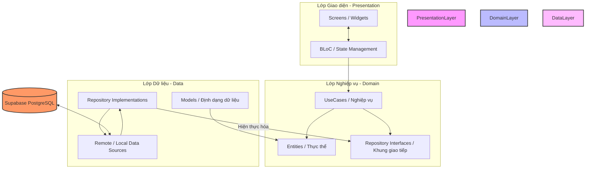

# 📑 BÁO CÁO TOÀN DIỆN: KIẾN TRÚC & CHỨC NĂNG HỆ THỐNG E-COMMERCE & ADMIN PORTAL (SHARECO)

Tài liệu này được biên soạn chi tiết nhằm giúp bạn nắm vững cấu trúc thư mục, kiến trúc phần mềm, luồng xử lý dữ liệu và cách tương tác với cơ sở dữ liệu **Supabase** của hệ thống E-Commerce và Admin Portal thuộc dự án **Shareco**. Bạn có thể dùng tài liệu này làm cẩm nang ôn tập để tự tin thuyết trình và trả lời xuất sắc mọi câu hỏi từ Giáo viên hướng dẫn/Hội đồng chấm thi.

---

## 🗺️ PHẦN 1: TỔNG QUAN KIẾN TRÚC SẠCH (CLEAN ARCHITECTURE)

Hệ thống được phát triển tuân thủ nghiêm ngặt mô hình **Clean Architecture** (Kiến trúc sạch). Mô hình này chia mã nguồn thành **3 lớp tách biệt hoàn toàn**: **Data (Dữ liệu)**, **Domain (Nghiệp vụ cốt lõi)**, và **Presentation (Giao diện hiển thị)**.

### 🌟 Tại sao phải dùng Clean Architecture?
1. **Dễ bảo trì và mở rộng (Maintainability & Scalability):** Khi bạn muốn đổi cơ sở dữ liệu (ví dụ từ Supabase sang Firebase) hoặc thay đổi thư viện UI, bạn chỉ cần sửa đổi lớp *Data* hoặc *Presentation*, còn lớp *Domain* (chứa logic nghiệp vụ cốt lõi) hoàn toàn được giữ nguyên.
2. **Dễ viết kiểm thử (Testability):** Bạn có thể viết Unit Test cho lớp *Domain* độc lập mà không cần khởi chạy ứng dụng hay kết nối mạng thực tế bằng cách sử dụng các đối tượng giả lập (Mock Repositories).
3. **Tính độc lập cao (Decoupling):** Giao diện UI không được phép biết cách kết nối trực tiếp đến database, nó chỉ biết gọi các hành động (UseCases). Cơ sở dữ liệu cũng không được phép áp đặt cấu trúc dữ liệu lên giao diện hiển thị.



---

## 📂 PHẦN 2: LÝ DO MỖI THƯ MỤC CHỨC NĂNG CÓ CẤU TRÚC "DATA - DOMAIN - PRESENTATION"

Trong các dự án Flutter chuyên nghiệp quy mô lớn, người ta thường áp dụng mô hình kết hợp **Feature-First (Theo Tính năng)** và **Layered Architecture (Kiến trúc phân lớp)**. 

Thay vì gom tất cả các file Data của cả ứng dụng vào một chỗ, gom tất cả UI vào một chỗ khác, chúng ta chia ứng dụng thành các tính năng độc lập (như `shop`, `cart`, `checkout`...). Bên trong **mỗi tính năng đó** lại được chia thành 3 lớp riêng biệt: **Data**, **Domain** và **Presentation**.

### 🌟 Ý nghĩa thiết kế này mang lại:
1. **Tính đóng gói tối đa (High Encapsulation):** Mỗi thư mục tính năng là một "tiểu ứng dụng" tự vận hành. Nó tự quản lý từ giao diện, nghiệp vụ cho đến cách lấy dữ liệu từ database. Nếu bạn muốn xóa bỏ tính năng `review`, bạn chỉ cần xóa thư mục `review` mà không sợ làm hỏng các tính năng khác.
2. **Dễ phân chia công việc:** Lập trình viên A có thể phát triển toàn bộ luồng của tính năng `cart` (từ thiết kế UI, viết BLoC đến viết hàm gọi Supabase) trong thư mục `cart` mà không đụng chạm đến file của lập trình viên B đang phát triển tính năng `shop`.

---

### 🔍 Giải thích chi tiết vai trò của từng Thư mục con bên trong mỗi Tính năng:

Để dễ hình dung, chúng ta lấy thư mục **`shop`** làm ví dụ điển hình cho cấu trúc phân lớp này:

```
lib/features/ecommerce/shop/
├── data/                    <-- Lớp Dữ liệu (Hiện thực kết nối dữ liệu)
│   ├── datasources/         <-- Nơi gọi trực tiếp database Supabase
│   ├── models/              <-- Định dạng dữ liệu thô nhận về (Map/JSON)
│   └── repositories/        <-- Nhận data thô, biến đổi thành thực thể sạch
├── domain/                  <-- Lớp Nghiệp vụ (Thiết kế hệ thống cốt lõi)
│   ├── entities/            <-- Cấu trúc dữ liệu thuần dùng cho UI hiển thị
│   ├── repositories/        <-- Bản thiết kế trừu tượng (Interface) các hàm
│   └── usecases/            <-- Từng kịch bản/hành động nghiệp vụ chi tiết
└── presentation/            <-- Lớp Giao diện (Hiển thị & Xử lý tương tác)
    ├── bloc/                <-- Quản lý luồng trạng thái của giao diện
    └── screen/              <-- File giao diện Flutter vẽ màn hình người dùng
```

#### 1. Thư mục `domain/` (Nghiệp vụ - Trái tim của tính năng)
Lớp này lưu trữ logic nghiệp vụ cốt lõi và các thực thể dữ liệu "sạch" nhất, không liên quan đến cơ sở dữ liệu.
* **`entities/` (Ví dụ: `shop.dart`):** Định nghĩa cấu trúc dữ liệu của một Cửa hàng/Thương hiệu mà giao diện sẽ hiển thị (như Tên, Logo, Đánh giá trung bình...). File này chỉ chứa thuộc tính và hàm khởi tạo, hoàn toàn **không chứa mã chuyển đổi dữ liệu từ API (`fromJson`/`toJson`)**.
* **`repositories/` (Ví dụ: `shop_repository.dart`):** Định nghĩa một class trừu tượng (`abstract class`). Nó hoạt động như một **bản hợp đồng** quy định những hành động mà tính năng này có thể làm (ví dụ: *Tôi cần một hàm để lấy chi tiết gian hàng*). Nó không lập trình chi tiết hàm đó chạy thế nào, mà để lớp *Data* hiện thực hóa sau.
* **`usecases/` (Ví dụ: `get_shop_details.dart`):** Chứa các lớp thực hiện **một hành động duy nhất** của người dùng. Ví dụ, use case `GetShopDetails` chỉ làm đúng một việc: gọi hàm từ repository để lấy thông tin shop và trả về cho BLoC.

#### 2. Thư mục `data/` (Dữ liệu - Kết nối cơ sở dữ liệu bên ngoài)
Lớp này chịu trách nhiệm trực tiếp trong việc kết nối mạng, đọc/ghi dữ liệu và chuyển đổi dữ liệu thô từ cơ sở dữ liệu thành thực thể có nghĩa.
* **`datasources/` (Ví dụ: `shop_remote_datasource.dart`):** Đây là nơi **gọi trực tiếp Supabase Client** để thực thi các câu lệnh truy vấn SQL. Nó lấy về các dữ liệu dạng bản đồ khóa - giá trị (`Map<String, dynamic>` hoặc `JSON`).
* **`models/` (Ví dụ: `shop_model.dart`):** Kế thừa (`extends`) từ Entity ở lớp Domain. Class này bổ sung thêm các hàm **`fromJson()`** (để chuyển dữ liệu JSON từ Supabase thành đối tượng Dart) và **`toJson()`** (để chuyển đối tượng Dart thành JSON gửi lên Supabase).
* **`repositories/` (Ví dụ: `shop_repository_impl.dart`):** Kế thừa và hiện thực hóa bản hợp đồng từ `domain/repositories/shop_repository.dart`. Nó sẽ gọi hàm của `RemoteDataSource` để lấy về đối tượng `ShopModel`, sau đó chuyển đổi (`cast`) đối tượng này thành thực thể `Shop` thuần túy và trả ngược lại cho lớp Domain.

#### 3. Thư mục `presentation/` (Giao diện - Tương tác trực quan với người dùng)
Lớp này xử lý việc hiển thị giao diện người dùng và phản hồi lại các thao tác nhấn nút, nhập liệu của họ.
* **`bloc/` (Ví dụ: `shop_bloc.dart`, `shop_event.dart`, `shop_state.dart`):** Quản lý trạng thái giao diện bằng thư viện Flutter BLoC.
  * **`shop_event.dart`:** Khai báo các hành động của người dùng (Ví dụ: người dùng mở trang thương hiệu thì kích hoạt sự kiện `FetchShopDetailsEvent`).
  * **`shop_state.dart`:** Khai báo các trạng thái giao diện có thể xảy ra (Ví dụ: `ShopLoading` đang tải, `ShopLoaded` tải thành công kèm dữ liệu, `ShopError` lỗi tải).
  * **`shop_bloc.dart`:** Nhận sự kiện `Event`, gọi UseCase tương ứng từ lớp Domain, nhận về kết quả và phát ra trạng thái `State` phù hợp.
* **`screen/` (Ví dụ: `shop_detail_screen.dart`):** Đây là màn hình Flutter trực quan. Nó lắng nghe các trạng thái (`State`) từ BLoC phát ra: nếu là `ShopLoading` thì hiển thị vòng tròn xoay xoay, nếu là `ShopLoaded` thì vẽ lên các thông tin thương hiệu, hình ảnh logo cực kỳ đẹp mắt.

---

## 🔄 PHẦN 3: LUỒNG CHẠY CHI TIẾT TỪNG TÍNH NĂNG (FILE TO FILE CALL WALKTHROUGH)

Để giúp bạn hiểu thật rõ "khi người dùng bấm một cái nút thì chuyện gì xảy ra trong code, file nào gọi file nào", dưới đây là sơ đồ chi tiết từng chuỗi liên kết gọi tệp (Call chain) của các tính năng nổi bật:

---

### 1. 🏷️ Tính năng "SHOP" - Luồng Xem Chi Tiết Nhãn Hàng
**Kịch bản:** Khách hàng bấm chọn nhãn hàng "L'Oreal" để vào xem trang thông tin chi tiết nhãn hàng.

```
[Người dùng] 
   │  (Bấm chọn thương hiệu)
   ▼
1. ShopDetailScreen (presentation/screen/) 
   │  ↳ Gọi: initState()
   │  ↳ Thực hiện: gửi sự kiện `FetchShopDetail(shopId)` vào ShopBloc.
   ▼
2. ShopBloc (presentation/bloc/)
   │  ↳ Nhận Event: `FetchShopDetail`
   │  ↳ Thực hiện: gọi hàm `call(shopId)` của UseCase `GetShopDetailUseCase`.
   ▼
3. GetShopDetailUseCase (domain/usecases/)
   │  ↳ Hàm gọi: `call(shopId)`
   │  ↳ Thực hiện: gọi phương thức `getShopDetail(shopId)` của interface `ShopRepository`.
   ▼
4. ShopRepository (domain/repositories/)
   │  ↳ Định nghĩa Interface (hợp đồng trừu tượng)
   │  ↳ Thực hiện: chuyển tiếp thực thi đến lớp cài đặt thực tế `ShopRepositoryImpl`.
   ▼
5. ShopRepositoryImpl (data/repositories/)
   │  ↳ Lớp hiện thực thực tế
   │  ↳ Thực hiện: gọi hàm `fetchShopDetail(shopId)` từ `ShopRemoteDataSource`.
   ▼
6. ShopRemoteDataSource (data/datasources/)
   │  ↳ Hàm gọi: `fetchShopDetail(shopId)`
   │  ↳ Tương tác Database: gọi API trực tiếp đến Supabase:
   │    `client.from('shops').select().eq('id', shopId).single()`
   │  ↳ Kết quả nhận về: một đối tượng thô kiểu `Map<String, dynamic> json`.
   ▼
7. ShopModel (data/models/)
   │  ↳ Hàm khởi tạo: `ShopModel.fromJson(json)` được Datasource kích hoạt.
   │  ↳ Thực hiện: Ánh xạ và chuyển đổi cấu trúc JSON thành đối tượng `ShopModel` trong Dart.
   ▼
[Trả ngược kết quả theo mô hình Dartz Either]
   │  ↳ ShopRemoteDataSource trả `ShopModel` về cho ShopRepositoryImpl.
   │  ↳ ShopRepositoryImpl đóng gói kết quả thành kiểu thành công `Right(Shop)` (hoặc lỗi `Left(Failure)`).
   │  ↳ GetShopDetailUseCase trả kết quả `Either<Failure, Shop>` về cho ShopBloc.
   ▼
8. ShopBloc (presentation/bloc/)
   │  ↳ Nhận kết quả từ UseCase, phân tích bằng hàm `.fold()`:
   │    - Nếu thất bại (Left): Phát ra trạng thái `ShopError(message)`.
   │    - Nếu thành công (Right): Phát ra trạng thái `ShopLoaded(shop)`.
   ▼
9. ShopDetailScreen (presentation/screen/)
   │  ↳ BlocBuilder lắng nghe được trạng thái `ShopLoaded`.
   │  ↳ Giải nén thực thể `Shop` để vẽ Logo, Ảnh bìa, Tên nhãn hàng tuyệt đẹp lên màn hình!
```

---

### 🛒 2. Tính năng "CART" - Luồng Thêm Sản Phẩm Vào Giỏ Hàng
**Kịch bản:** Người dùng bấm nút "Thêm vào giỏ hàng" tại trang chi tiết sản phẩm.

```
[Người dùng] 
   │  (Bấm chọn biến thể và bấm nút "Thêm vào giỏ")
   ▼
1. ProductDetailScreen (features/product/presentation/screen/)
   │  ↳ Thực hiện: gọi sự kiện `AddToCartEvent(productId, variantId, qty)` thông qua CartBloc.
   ▼
2. CartBloc (features/cart/presentation/bloc/)
   │  ↳ Nhận Event: `AddToCartEvent`
   │  ↳ Thực hiện: gọi hàm `call(params)` của UseCase `AddToCartUseCase`.
   ▼
3. AddToCartUseCase (features/cart/domain/usecases/)
   │  ↳ Thực hiện: gọi hàm `addToCart()` trên interface `CartRepository`.
   ▼
4. CartRepositoryImpl (features/cart/data/repositories/)
   │  ↳ Thực hiện: gọi hàm `addToCart()` của `CartRemoteDataSource`.
   ▼
5. CartRemoteDataSource (features/cart/data/datasources/)
   │  ↳ Tương tác Database Supabase:
   │    - Kiểm tra xem mặt hàng này đã có sẵn trong giỏ của User đó chưa:
   │      `client.from('cart_items').select().eq('cart_id', cartId).eq('variant_id', variantId)`
   │    - Nếu đã có: Thực hiện tăng số lượng bằng lệnh `UPDATE`:
   │      `client.from('cart_items').update({'qty': existingQty + newQty}).eq('id', itemId)`
   │    - Nếu chưa có: Thực hiện chèn mới bằng lệnh `INSERT`:
   │      `client.from('cart_items').insert({...})`
   │  ↳ Trả về trạng thái lưu thành công.
   ▼
[Trả ngược kết quả qua CartRepositoryImpl -> AddToCartUseCase -> CartBloc]
   ▼
6. CartBloc (features/cart/presentation/bloc/)
   │  ↳ Phát ra trạng thái thành công: `CartItemAddedState`.
   ▼
7. ProductDetailScreen (features/product/presentation/screen/)
   │  ↳ Nhận trạng thái thành công, hiển thị hộp thoại Toast/Snackbar thông báo:
   │    "Đã thêm sản phẩm vào giỏ hàng thành công! 🛒" đầy sinh động!
```

---

### 📍 3. Tính năng "ADDRESS" - Luồng Lưu Địa Chỉ Giao Hàng Mới
**Kịch bản:** Người mua bấm chọn "Lưu địa chỉ" trong form nhập địa chỉ nhận hàng mới.

```
1. AddressFormScreen (features/address/presentation/screen/)
   │  ↳ Người dùng điền Họ tên, SĐT, Địa chỉ chi tiết và bấm "Lưu".
   │  ↳ Gọi sự kiện: gửi `SaveAddressEvent(addressData)` tới AddressBloc.
   ▼
2. AddressBloc (features/address/presentation/bloc/)
   │  ↳ Nhận Event, gọi UseCase `SaveAddressUseCase`.
   ▼
3. SaveAddressUseCase (features/address/domain/usecases/)
   │  ↳ Gọi phương thức `saveAddress(address)` trên interface `AddressRepository`.
   ▼
4. AddressRepositoryImpl (features/address/data/repositories/)
   │  ↳ Gọi hàm `saveAddress(addressModel)` của `AddressRemoteDataSource`.
   ▼
5. AddressRemoteDataSource (features/address/data/datasources/)
   │  ↳ Tương tác Database Supabase: thực hiện chèn dữ liệu địa chỉ mới vào bảng `user_addresses`:
   │    `client.from('user_addresses').insert(addressModel.toJson())`
   │  ↳ Trả về bản ghi vừa tạo thành công.
   ▼
[Trả ngược kết quả thành công qua AddressRepositoryImpl -> SaveAddressUseCase]
   ▼
6. AddressBloc (features/address/presentation/bloc/)
   │  ↳ Phát ra trạng thái: `AddressSavedSuccess`.
   │  ↳ Tự động kích hoạt nạp lại danh sách địa chỉ: phát ra sự kiện `FetchAddressesEvent`.
   ▼
7. AddressListScreen (features/address/presentation/screen/)
   │  ↳ Lắng nghe được trạng thái lưu thành công, tự động tắt form nhập, 
   │    hiển thị danh sách địa chỉ mới được cập nhật trên màn hình!
```

---

### 💳 4. Tính năng "CHECKOUT" - Luồng Đặt Đơn Hàng & Trừ Tồn Kho
**Kịch bản:** Người dùng xác nhận đơn hàng và bấm "Đặt hàng" tại trang thanh toán.

```
1. CheckoutScreen (features/checkout/presentation/screen/)
   │  ↳ Khách bấm nút "Đặt hàng".
   │  ↳ Gọi sự kiện: gửi `PlaceOrderEvent` đến CheckoutBloc.
   ▼
2. CheckoutBloc (features/checkout/presentation/bloc/)
   │  ↳ Gọi UseCase `PlaceOrderUseCase`.
   ▼
3. PlaceOrderUseCase (features/checkout/domain/usecases/)
   │  ↳ Gọi hàm `placeOrder()` trên interface `CheckoutRepository`.
   ▼
4. CheckoutRepositoryImpl (features/checkout/data/repositories/)
   │  ↳ Gọi hàm `placeCartOrder()` trên lớp `CheckoutRemoteDataSource`.
   ▼
5. CheckoutRemoteDataSource (features/checkout/data/datasources/)
   │  ↳ THỰC HIỆN TOÀN BỘ GIAO DỊCH (TRANSACTION) LÊN SUPABASE:
   │    - Bước A: Chèn đơn hàng mới vào bảng `orders`:
   │      `client.from('orders').insert({...}).select('id, order_code, total_amount')`
   │    - Bước B: Chèn các chi tiết sản phẩm mua vào bảng `order_items`.
   │    - Bước C (Trừ kho tự động): Duyệt danh sách sản phẩm đặt mua:
   │      + Lấy tồn kho biến thể: `client.from('product_variants').select('stock_qty').eq('id', variantId)`
   │      + Trừ kho biến thể: `client.from('product_variants').update({'stock_qty': currentStock - qty}).eq('id', variantId)`
   │      + Lấy tổng kho sản phẩm: `client.from('products').select('stock_total').eq('id', productId)`
   │      + Trừ tổng kho sản phẩm: `client.from('products').update({'stock_total': currentTotal - qty}).eq('id', productId)`
   │    - Bước D: Xóa sạch các mặt hàng vừa mua trong giỏ hàng `cart_items`.
   │  ↳ Trả về đối tượng `CheckoutResultModel` chứa mã đơn hàng và số tiền cuối cùng.
   ▼
[Trả ngược kết quả thành công qua các lớp]
   ▼
6. CheckoutBloc (features/checkout/presentation/bloc/)
   │  ↳ Phát ra trạng thái thành công: `CheckoutSuccess(result)`.
   ▼
7. CheckoutScreen (features/checkout/presentation/screen/)
   │  ↳ Điều hướng chuyển tiếp người dùng sang trang Đơn hàng thành công 
   │    và hiển thị mã đơn hàng cùng tổng số tiền! 🎉
```

---

### 📋 5. Tính năng "ORDER" - Luồng Khách Hàng Hủy Đơn Hàng
**Kịch bản:** Người dùng muốn hủy một đơn hàng đang ở trạng thái Chờ xác nhận (`pending`).

```
1. OrderListScreen (features/order/presentation/screen/)
   │  ↳ Người dùng bấm nút "Hủy đơn hàng" tại tab "Chờ xác nhận".
   │  ↳ Gọi sự kiện: gửi `CancelOrderEvent(orderId)` tới OrderBloc.
   ▼
2. OrderBloc (features/order/presentation/bloc/)
   │  ↳ Gọi UseCase `CancelOrderUseCase`.
   ▼
3. CancelOrderUseCase (features/order/domain/usecases/)
   │  ↳ Gọi hàm `cancelOrder(orderId)` trên interface `OrderRepository`.
   ▼
4. OrderRepositoryImpl (features/order/data/repositories/)
   │  ↳ Gọi hàm `cancelOrder(orderId)` của `OrderRemoteDataSource`.
   ▼
5. OrderRemoteDataSource (features/order/data/datasources/)
   │  ↳ Tương tác Database Supabase: cập nhật trạng thái đơn hàng thành `'cancelled'`:
   │    `client.from('orders').update({'status': 'cancelled'}).eq('id', orderId)`
   │  ↳ Trả về kết quả cập nhật thành công.
   ▼
[Trả ngược kết quả thành công qua các lớp]
   ▼
6. OrderBloc (features/order/presentation/bloc/)
   │  ↳ Phát ra trạng thái: `OrderCancelledSuccess`.
   │  ↳ Tự động kích hoạt tải lại danh sách đơn hàng để cập nhật giao diện.
   ▼
7. OrderListScreen (features/order/presentation/screen/)
   │  ↳ Đơn hàng biến mất khỏi tab "Chờ xác nhận" và chuyển sang tab "Đã hủy" tức thì!
```

---

### 👑 6. Tính năng "ADMIN" - Luồng Cổng Quản Trị Đảo Trạng Thái Mở Bán/Ẩn Ngừng Sản Phẩm Tức Thì
**Kịch bản:** Đối tác nhãn hàng mở cổng Web, bấm trực tiếp lên nút trạng thái của sản phẩm để khóa bán hoặc kích hoạt bán lại sản phẩm đó.

```
1. AdminProductsScreen (features/admin/presentation/screen/)
   │  ↳ Admin rê chuột vào nhãn "Đang bán" (hiển thị Tooltip: "Bấm để ngừng bán") và bấm chuột.
   │  ↳ Giao diện kích hoạt hàm xử lý bất đồng bộ trực tiếp (`onTap` của InkWell).
   ▼
2. Database Supabase (Tương tác trực tiếp từ UI để đạt tốc độ xử lý nhanh gọn):
   │  - Bước A: Đảo trạng thái sản phẩm trong bảng `products` (từ 'active' thành 'inactive' hoặc ngược lại):
   │    `await client.from('products').update({'status': nextStatus}).eq('id', productId)`
   │  - Bước B: Đồng bộ hóa trạng thái trên bảng biến thể sản phẩm `product_variants`:
   │    `await client.from('product_variants').update({'status': nextStatus}).eq('product_id', productId)`
   ▼
3. AdminProductsScreen (Hàm callback kết quả trả về thành công):
   │  ↳ Gọi lệnh: `context.read<AdminBloc>().add(AdminFetchProducts(shopId: currentShopId))`
   │  ↳ AdminBloc lập tức kéo danh sách sản phẩm mới nhất từ Supabase về.
   │  ↳ Hiển thị thanh Snackbar thông báo trạng thái mới siêu mượt: 
   │    "Đã chuyển trạng thái sản phẩm sang [Ẩn/Ngừng bán] 🛑" hoặc "Đã mở bán lại sản phẩm thành công! 🎉"
   │  ↳ Màn hình tự cập nhật đổi màu thẻ trạng thái từ Xanh (Đang bán) sang Hồng (Ẩn/Ngừng) cực sống động!
```

---

## ⚡ PHẦN 4: CÁCH GỌI VÀ TƯƠNG TÁC VỚI SUPABASE CHI TIẾT

Hệ thống giao tiếp với cơ sở dữ liệu Supabase (được xây dựng trên nền tảng PostgreSQL) thông qua gói thư viện chính thức `supabase_flutter`. Dưới đây là các kỹ thuật gọi truy vấn chi tiết được áp dụng trong dự án:

### 1. Hàm truy vấn dữ liệu thông thường (SELECT)
Chúng ta gọi dữ liệu bằng cách sử dụng các hàm lọc `.select()`, `.eq()`, `.order()` cực kỳ linh hoạt.
```dart
// Lấy danh sách sản phẩm theo từng Nhãn hàng (shopId) cụ thể
final response = await Supabase.instance.client
    .from('products')
    .select('*, product_variants(*)') // JOIN lấy kèm danh sách biến thể của sản phẩm đó
    .eq('shop_id', shopId)
    .order('created_at', ascending: false);
```

### 2. Hàm thêm mới dữ liệu (INSERT)
```dart
// Thêm một nhãn hàng đối tác mới
await Supabase.instance.client.from('shops').insert({
  'shop_name': name,
  'description': description,
  'shop_slug': slug,
  'logo_path': logoUrl,
  'cover_path': coverUrl,
  'status': 'active',
});
```

### 3. Hàm cập nhật dữ liệu trực tiếp (UPDATE)
Dùng để thay đổi thông tin hoặc đảo trạng thái hoạt động của sản phẩm ngay tại chỗ.
```dart
// Đảo trạng thái hoạt động của sản phẩm (Đang bán <--> Ẩn/Ngừng)
await Supabase.instance.client
    .from('products')
    .update({'status': 'inactive'}) // chuyển sang trạng thái ẩn ngừng
    .eq('id', productId);
```

### 4. Công nghệ Lắng nghe Sự kiện Thời gian thực (Supabase Realtime Channel)
Trong màn hình quản lý đơn hàng của Admin (`admin_orders_screen.dart`), để Admin không cần tải lại trang mỗi khi khách đặt đơn mới, ta thiết lập một kênh kết nối liên tục (Websocket) để lắng nghe sự thay đổi của bảng `orders`:
```dart
// 1. Tạo một kênh kết nối realtime
final _ordersChannel = Supabase.instance.client
    .channel('public:orders')
    // 2. Lắng nghe mọi sự kiện INSERT hoặc UPDATE trên bảng 'orders'
    .onPostgresChanges(
      event: PostgresChangeEvent.all,
      schema: 'public',
      table: 'orders',
      callback: (payload) {
        debugPrint('Có đơn hàng mới hoặc đơn hàng vừa được cập nhật!');
        // 3. Tự động kích hoạt gọi BLoC tải lại danh sách đơn hàng tức thì
        _adminBloc.add(AdminFetchOrders(shopId: _selectedShopId));
      },
    );

// 4. Kích hoạt kết nối lắng nghe
_ordersChannel.subscribe();
```

---

## 🎓 PHẦN 5: BỘ CÂU HỎI VÀ ĐÁP ÁN (Q&A CHEAT SHEET) THUYẾT TRÌNH TRƯỚC GIÁO VIÊN

Dưới đây là những câu hỏi cực kỳ hóc búa mà các giáo viên hướng dẫn thường hỏi để kiểm tra xem bạn có thực sự hiểu bài hay không, đi kèm là gợi ý trả lời thông minh giúp bạn đạt điểm tối đa:

#### 💬 Câu hỏi 1: Tại sao em lại phân tách thư mục của mình thành các phần "address", "cart", "checkout", "product", "shop" riêng biệt thay vì dồn chung vào một file?
* **💡 Trả lời:** Thưa thầy/cô, việc chia nhỏ cấu trúc thư mục theo mô hình **Feature-First (Theo tính năng)** giúp hệ thống đạt được tính đóng gói rất cao. Mỗi module như `cart` hay `checkout` sẽ tự quản lý toàn bộ các lớp giao diện, nghiệp vụ và dữ liệu của riêng nó. Thiết kế này giúp dự án cực kỳ dễ đọc, dễ bảo trì, và khi có nhiều lập trình viên cùng làm việc, chúng em có thể phát triển song song các tính năng khác nhau mà không lo bị xung đột mã nguồn (code conflict).

#### 💬 Câu hỏi 2: Sự khác nhau giữa lớp Entity (trong Domain) và lớp Model (trong Data) là gì? Tại sao không dùng chung một lớp cho đỡ tốn file?
* **💡 Trả lời:** Đây là nguyên tắc cốt lõi của Clean Architecture nhằm đảm bảo **tính độc lập của lớp nghiệp vụ**. 
  * **Entity** là đối tượng thuần túy đại diện cho nghiệp vụ của doanh nghiệp ở lớp Domain, hoàn toàn không biết gì về cơ sở dữ liệu hay mạng internet.
  * **Model** nằm ở lớp Data, kế thừa từ Entity nhưng được trang bị thêm các hàm phân tích cú pháp dữ liệu như `fromJson` và `toJson`.
  Nếu chúng em dồn chung làm một, lớp nghiệp vụ cốt lõi sẽ bị phụ thuộc chặt chẽ vào cấu trúc bảng của Supabase hay API bên ngoài. Khi database thay đổi tên cột hoặc cấu trúc JSON, chúng em sẽ buộc phải sửa đổi lại toàn bộ logic nghiệp vụ bên trong ứng dụng, điều này vi phạm nguyên tắc thiết kế phần mềm bền vững.

#### 💬 Câu hỏi 3: Hệ thống của em xử lý việc trừ tồn kho như thế nào khi khách đặt hàng thành công? Có đảm bảo không bị âm kho không?
* **💡 Trả lời:** Thưa thầy/cô, logic trừ kho của hệ thống được thực hiện khép kín và cực kỳ an toàn ngay trong lớp dữ liệu (`checkout_remote_datasource.dart`). Khi tạo đơn hàng thành công, hệ thống sẽ thực thi trừ số lượng mua trực tiếp vào cột `stock_qty` của bảng biến thể sản phẩm (`product_variants`) và cột `stock_total` của sản phẩm gốc (`products`). Để đảm bảo tính an toàn tối đa và tránh việc kho hàng bị ghi nhận số âm dưới các điều kiện đặc biệt, chúng em đã áp dụng hàm giới hạn biên dưới `.clamp(0, 999999)`.

#### 💬 Câu hỏi 4: Làm thế nào để cổng quản trị Admin phân biệt được người đăng nhập là Super Admin hệ thống hay là Đối tác nhãn hàng để phân quyền màn hình cho đúng?
* **💡 Trả lời:** Hệ thống sử dụng một lớp lưu trữ phiên làm việc toàn cục tên là `AdminSession`. Khi người dùng đăng nhập qua màn hình `AdminLoginScreen`:
  * Nếu Email chứa từ khóa `"admin"`, hệ thống ghi nhận vai trò `loggedInRole = 'admin'` (Super Admin) và chuyển hướng tới màn hình quản lý thương hiệu `shops`. Màn hình này cho phép quản lý tích xanh, chặn hoặc cấp phép hoạt động đối tác.
  * Nếu Email thuộc về đối tác (như `loreal@shareco.vn`), hệ thống ghi nhận vai trò `loggedInRole = 'shop'` kèm theo `loggedInShopId` tương ứng. Giao diện Sidebar (`admin_layout.dart`) sẽ tự động ẩn đi phần quản lý thương hiệu toàn sàn, chỉ hiển thị "Kho hàng của tôi" và "Đơn hàng của tôi" được lọc chính xác theo `shopId` của đối tác đó, đảm bảo tính bảo mật và độc lập tuyệt đối giữa các nhãn hàng.
